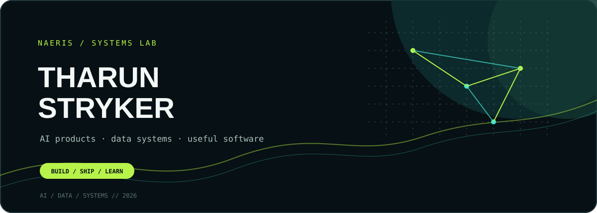
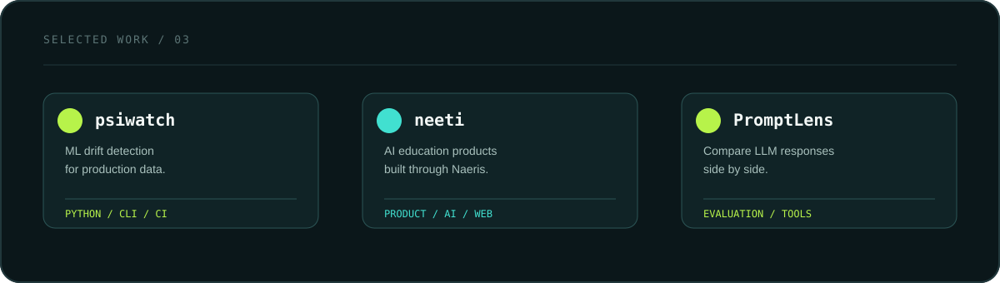

<p align="center">
  
</p>

<p align="center">
  <a href="https://naeris.vercel.app">PORTFOLIO</a> ·
  <a href="https://github.com/tharunstryker">GITHUB</a> ·
  <a href="mailto:tharunstryker@gmail.com">EMAIL</a>
</p>

# I build useful systems for messy problems.

I’m **Tharun Stryker**, a founder and engineer working across **AI products, data systems, developer tools, and education technology**.

I care about the part after the demo: reliable behavior, clear interfaces, sensible security, and software that another person can actually use.

> **Current signal:** building through [Naeris](https://naeris.vercel.app), shipping open-source tools, and turning AI ideas into working products.

<br />

<p align="center">
  
</p>

## Selected work

<table>
<tr>
<td width="33%" valign="top">

### [`psiwatch`](https://github.com/tharunstryker/psiwatch)

**ML drift detection without the baggage.**

A lightweight Python library for comparing training and production data with PSI, chi-square, and mean-shift analysis.

[PyPI](https://pypi.org/project/psiwatch) · [Source](https://github.com/tharunstryker/psiwatch)

</td>
<td width="33%" valign="top">

### Neeti by Aevra

**AI tools for learning and direction.**

An education product combining career guidance workflows with an interactive card creation experience.

[Visit Naeris](https://naeris.vercel.app)

</td>
<td width="33%" valign="top">

### [`PromptLens`](https://github.com/tharunstryker/PromptLens)

**A workbench for comparing LLM outputs.**

A toolkit for testing prompt variations and evaluating responses from multiple providers side by side.

[Explore the repo](https://github.com/tharunstryker/PromptLens)

</td>
</tr>
</table>

## The kind of engineering I enjoy

```text
product surface        →  simple enough to understand
AI behavior             →  observable enough to trust
data movement           →  explicit enough to debug
security boundaries     →  deliberate enough to explain
shipping                →  frequent enough to learn
```

## Tools I reach for

| Building | Working with |
|---|---|
| **Products** | JavaScript, TypeScript, Python, HTML, CSS |
| **AI systems** | LLM APIs, embeddings, evaluation workflows, provider fallbacks |
| **Data systems** | PostgreSQL, Supabase, REST APIs, drift detection |
| **Delivery** | Vercel, Edge Functions, GitHub Actions, Linux, CI/CD |

## A little more context

- **Founder & engineer at Naeris** — product direction, architecture, implementation, deployment.
- **Open-source builder** — focused on small tools that solve specific, expensive problems.
- **AI systems practitioner** — interested in reliability, evaluation, observability, and useful interfaces.
- **Builder from Krishnagiri, Tamil Nadu** — currently building from a deliberately lightweight setup.

## If you are building something serious

I’m open to collaborating with early-stage teams on **AI/ML products, developer tools, data systems, and production architecture**.

If the problem is real and the product should be useful, [let’s talk](mailto:tharunstryker@gmail.com).

<br />

<p align="center">
  <sub>Built with curiosity, constraints, and a bias toward shipping.</sub>
</p>
